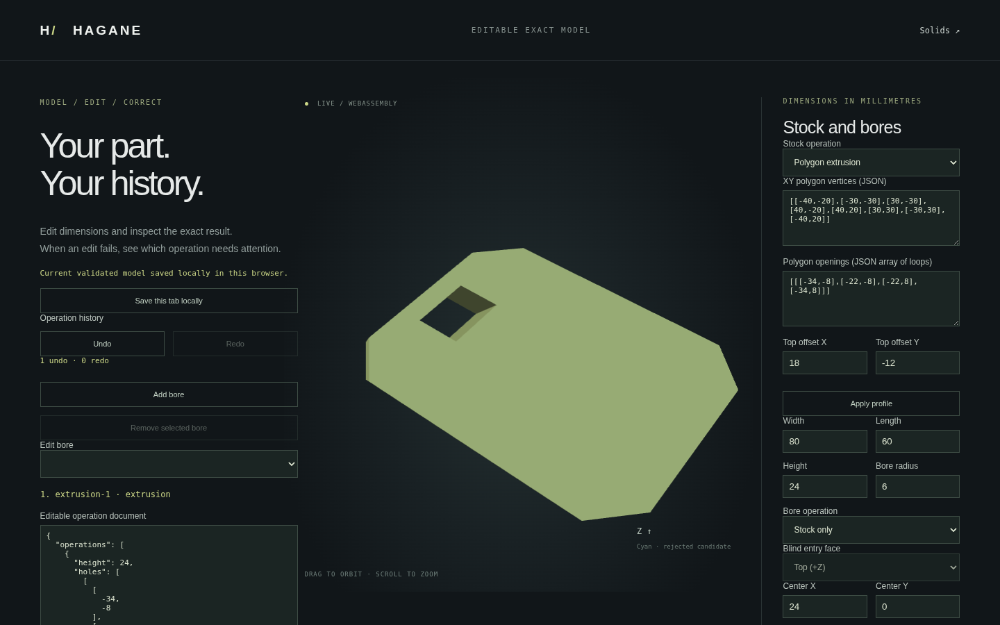

# Exact planar STEP export

Hagane now writes one validated closed planar, straight-edge solid as an AP214
ISO 10303-21 text file. It preserves shared vertices and edges, oriented face
bounds (including polygon openings), analytic lines and planes, shell orientation,
linear uncertainty and explicit millimetre units. No display mesh is exported.
Native and WASM output is deterministic; the header timestamp is left empty.

```rust
let step = hagane::export_step_planar_mm(&solid, tolerance)?;
std::fs::write("part.step", step)?;
```

Coordinates and tolerance are interpreted as millimetres. The exporter does not
infer or convert native coordinate units. It supports at most 4096 vertices,
4096 edges and 512 faces. Invalid topology, curved edges and curved surfaces
return errors. This includes cylindrical bore workflows: their export remains
unsupported. STEP import, curved export, assemblies and rich product metadata
remain future work; this is a supported subset, not general AP214 conformance.

Export the included skew extrusion with a polygon opening:

```sh
cargo run --quiet --locked --example step_export > part.step
# Or pass a versioned workflow document:
cargo run --quiet --example step_export -- docs/workflow-skew-extrusion-example.json > part.step
```

Run `./scripts/build-web.sh` and start the web demo as described in the README.
In `workflow.html`, load the same document and choose **Download STEP · planar
geometry**. Export failures leave the accepted model and editing history intact.



## Verification and provenance

Native tests check shared oriented topology, entity references, holes, microscopic
and large geometry, deterministic coordinates, invalid geometry and explicit
curved rejection. WASM tests compare native bytes and verify that rejected export
never replaces the incremental session. Browser tests exercise the download.

Optional independent import validation uses `occt-import-js` 0.0.23:

```sh
npm install --prefix /tmp/hagane-step-validator --no-audit --no-fund occt-import-js@0.0.23
node scripts/validate-step-external.mjs /tmp/hagane-step-validator/node_modules/occt-import-js
```

This tool is an external test oracle only, not a Hagane dependency or shipped
artifact. Its wrapper is LGPL-2.1 according to the package metadata; source and
license: <https://github.com/kovacsv/occt-import-js>. Its bundled Open CASCADE
Technology is LGPL-2.1 with the OCCT exception; see
<https://dev.opencascade.org/resources/licensing>. No OCCT implementation source
was copied or translated into the original Rust writer. The optional check imports
actual output and independently checks face count, bounds, positive analytic
volume and millimetre/metre conversion, including reversed profile winding.

Public format/entity references (specifications, not implementation sources):
- ISO 10303-21 overview: <https://en.wikipedia.org/wiki/ISO_10303-21>
- STEP application protocol overview: <https://www.steptools.com/stds/step/>
- Public EXPRESS entity documentation, including `advanced_face`, `edge_curve`,
  `manifold_solid_brep` and unit contexts: <https://www.steptools.com/stds/stp_aim/html/>
