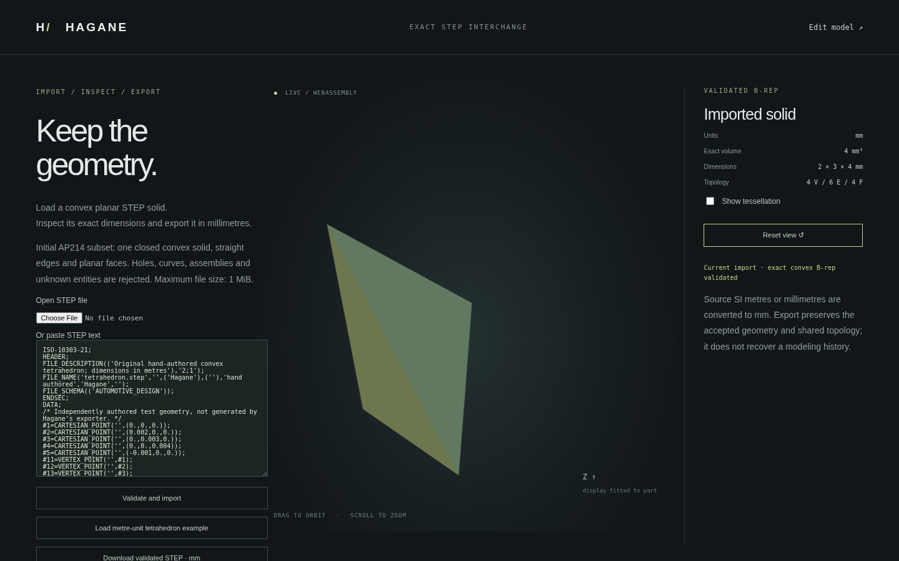

# Initial convex planar STEP import

Hagane now imports one closed **convex planar, straight-edge solid** from an
explicit AP214 (`AUTOMOTIVE_DESIGN`) ISO 10303-21 file. This is an original pure
Rust parser and B-rep reconstruction path, shared by native and WASM. It does not
use an OCCT binding, mesh reconstruction, face sewing, snapping or automatic
repair. Curved export has a broader supported domain than this first importer.

```rust
let input = std::fs::read_to_string("part.step")?;
let tolerance = hagane::Tolerance::new(1e-8)?; // mm, regardless of source units
let solid = hagane::import_step_planar_mm(&input, tolerance)?;
let output = hagane::export_step_planar_mm(&solid, tolerance)?;
std::fs::write("checked-part.step", output)?;
```

```sh
cargo run --quiet --locked --example step_import
cargo run --quiet --example step_import -- part.step
```

The example emits a JSON report containing validated B-rep metrics/bounds, a
B-rep-derived display mesh and re-exported STEP. Native callers also receive a
`Solid` suitable for existing scoped convex operations. Imports are not operation
history nodes; parameters or original construction intent are not recovered.

## Geometry, topology and units

The single `ADVANCED_BREP_SHAPE_REPRESENTATION` must reference exactly one
`MANIFOLD_SOLID_BREP` and one 3D unit context. Each face requires one
`FACE_OUTER_BOUND`, an `EDGE_LOOP` of `ORIENTED_EDGE`s, and a `PLANE` with
`AXIS2_PLACEMENT_3D`. Each shared `EDGE_CURVE` uses a `LINE` defined by a point
and a positive `VECTOR`/`DIRECTION`. Shared STEP entity IDs determine native
vertex/edge identity; coincident but separately named vertices are not merged.

Unbounded STEP lines are reparameterized as bounded native lines between their
referenced vertices after checking both endpoints against the source line and
checking `EDGE_CURVE.same_sense`. Oriented-edge traversal, bound reversal and
`ADVANCED_FACE.same_sense` are handled independently. Affine pcurves are rebuilt
in each orthonormal plane frame using the same parameter as the native 3D edge.
Default axis/reference directions (`$`) and non-unit direction ratios are
supported. Vertex positions are never snapped or welded.

The context must explicitly declare SI millimetres or metres, radians and
steradians, plus one positive length uncertainty in its length unit. Source
metres are converted to mm. The caller's tolerance is always in mm; file
uncertainty never increases it. Large line-origin/endpoint separations whose
roundoff budget exceeds that tolerance are explicitly rejected.

Native validation checks planar trims, edge endpoints, pcurve agreement, winding,
shared opposite uses, vertex links, connected closure and positive finite volume.
The existing convex supporting-plane certificate then rejects nonconvex or
geometrically ambiguous shapes. Face holes are rejected before reconstruction;
the reader does not assume that topological closure alone proves a valid solid.

## Supported syntax and bounded resources

The parser supports simple/known complex entities, forward references, arbitrary
entity order, finite decimal/exponent numbers, whitespace, `/* comments */`,
quoted labels and doubled apostrophes. Header description implementation level
is `2;1`. Geometry must use the entity subset above; the context and SI-unit
complex entities follow the layout emitted by the current writer. Known product
metadata field shapes are checked but their content is not interpreted or
retained; multiple products or shape definitions are rejected. Unknown entities, unused
geometry, unsupported complex layouts, duplicate IDs, dangling references and
additional shapes are rejected rather than silently discarded.

Bounds apply before reconstruction/validation:

- UTF-8 file size: 1 MiB; entities: 32768; parsed values: 131072.
- Syntax nesting: 16 levels; lists: 4096 values; complex records: 8 components.
- Faces: 1–128; coedges: 256 per face, 4096 total.
- Vertices and edges: at most 4096 each.

Cylinders, circles, arcs, ellipses, NURBS, face holes, nonconvex solids, multiple
solids, assemblies, transforms in representation graphs, conversion-based units,
other SI prefixes, unknown metadata/entity extensions and other application
protocols are unsupported. This does not claim general STEP schema conformance
or lossless product metadata interchange.

## Browser

Run the normal WASM build and web server from the README, then open `step.html`.
Paste a supported document or select a local `.step`/`.stp` file. The sample is
an independently hand-authored metre-unit tetrahedron with dimensions 2×3×4 mm
and analytic volume 4 mm³. The display fits/centres the mesh for inspection;
accepted geometry, metrics and exported coordinates remain in mm.



The browser supports orbit/zoom, tessellation display and download/re-import of
the validated solid. Failed imports retain the previous valid view with an
explicit status and disable export until a valid import succeeds. UTF-8 and size
errors are checked before transport; asynchronous file loads cannot overwrite a
newer import request. The importer has a separate bounded WASM input buffer and
does not alter the editable workflow's accepted incremental session.

## Validation and provenance

`docs/step-tetrahedron-metres.step` is original hand-authored test geometry, not
created by the exporter. It independently exercises metre conversion, arbitrary
LINE origins/vector magnitudes, negative edge `same_sense`, reversed bounds,
negative face `same_sense`, default placement axes and non-unit directions. Its
geometry and outward orientation are also checked by an optional external STEP
reader. Source and native re-export both have four faces, the expected bounds
and signed volume 4 mm³.

Native tests cover that fixture, box/skew/rotated round trips at microscopic,
normal and large scales, reconstructed pcurves, malformed topology/units,
uncertainty isolation, unknown/unused entities, numerical overflow, size/depth
limits and deterministic truncation/token mutations without panics. WASM tests
compare full native reports and re-exported bytes and exercise failure recovery
and accepted-workflow isolation. Browser tests cover file and pasted-text input,
metrics, camera controls, download/upload, malformed/oversized/invalid UTF-8
files, previous-view preservation and recovery.

The optional [external validator](step-export.md#verification-and-provenance)
checks both this independently authored file and the native import/re-export.
Its external-only tool licensing remains recorded there; no new kernel or
browser dependency was added. Public ISO 10303-21 and EXPRESS entity references
are also recorded there. Parser/reconstruction code and the test fixture are
original work licensed MIT OR Apache-2.0; no OCCT implementation source was used.
