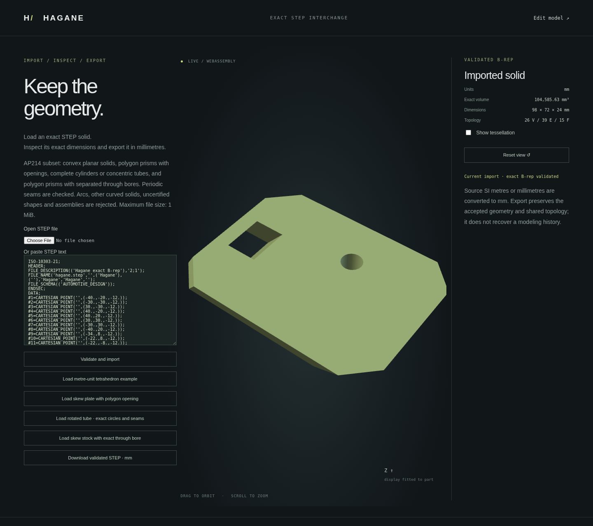
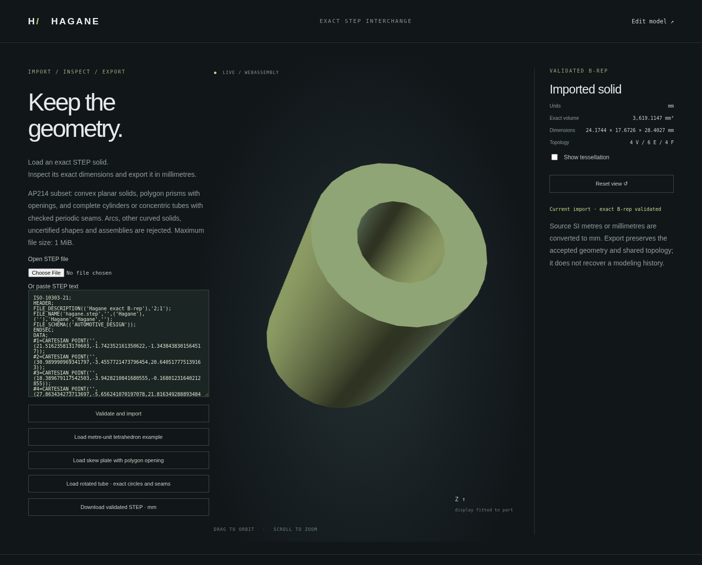
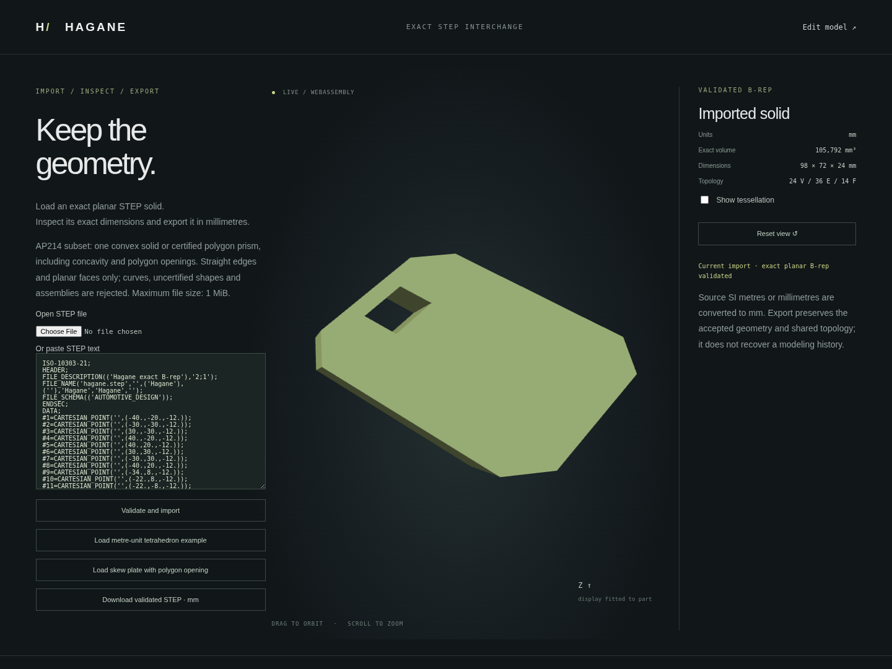

# Planar and complete cylindrical STEP import

Hagane imports one closed **convex planar solid, certified polygon prism
(including polygon openings and disjoint normal through bores), or complete
cylinder/concentric tube** from an
explicit AP214 (`AUTOMOTIVE_DESIGN`) ISO 10303-21 file. This is an original pure
Rust parser and B-rep reconstruction path, shared by native and WASM. It does not
use an OCCT binding, mesh reconstruction, face sewing, snapping or automatic
repair. Export still supports a broader domain than this importer.

```rust
let input = std::fs::read_to_string("part.step")?;
let tolerance = hagane::Tolerance::new(1e-8)?; // mm, regardless of source units
let solid = hagane::import_step_mm(&input, tolerance)?;
let output = hagane::export_step_mm(&solid, tolerance)?;
std::fs::write("checked-part.step", output)?;
```

```sh
cargo run --quiet --locked --example step_import
cargo run --quiet --example step_import -- part.step
```

The example emits a JSON report containing validated B-rep metrics/bounds, a
B-rep-derived display mesh and re-exported STEP. Native callers also receive a
`Solid` suitable for existing scoped planar operations. Imports are not operation
history nodes; parameters or original construction intent are not recovered.

## Geometry, topology and units

The single `ADVANCED_BREP_SHAPE_REPRESENTATION` must reference exactly one
`MANIFOLD_SOLID_BREP` and one 3D unit context. Each planar face requires one
`FACE_OUTER_BOUND` and optional `FACE_BOUND` holes, each with an `EDGE_LOOP` of
`ORIENTED_EDGE`s, and a `PLANE` with
`AXIS2_PLACEMENT_3D`. Each straight `EDGE_CURVE` uses a `LINE` defined by a point
and a positive `VECTOR`/`DIRECTION`. Shared STEP entity IDs determine native
vertex/edge identity; coincident but separately named vertices are not merged.

Unbounded STEP lines are reparameterized as bounded native lines between their
referenced vertices after checking both endpoints against the source line and
checking `EDGE_CURVE.same_sense`. Oriented-edge traversal, bound reversal and
`ADVANCED_FACE.same_sense` are handled independently. Affine pcurves are rebuilt
in each orthonormal plane frame using the same parameter as the native 3D edge.
Default axis/reference directions (`$`) and non-unit direction ratios are
supported. Vertex positions are never snapped or welded.

The context must explicitly declare SI millimetres or metres, radians and
steradians, plus one positive length uncertainty in its length unit. Source
metres are converted to mm. The caller's tolerance is always in mm; file
uncertainty never increases it. Large line-origin/endpoint separations whose
roundoff budget exceeds that tolerance are explicitly rejected.

Native validation checks planar trims, edge endpoints, pcurve agreement, winding,
shared opposite uses, vertex links, connected closure and positive finite volume.
For planar inputs, success requires either the existing convex supporting-plane
certificate or a translation-prism certificate. The latter accepts simple concave profiles and
disjoint polygon holes, skew/reversed extrusion and rigid placement. It checks
two opposite caps, bijective cap vertices/rings, one common translation and
exactly one correctly oriented quadrilateral side per profile edge. With `n`
profile corners, the shape must have `2n` vertices, `3n` edges and `n+2` faces;
subdivided sides/caps are outside this certificate. Cap separation must exceed
10 caller length tolerances. Coordinate/plane agreement uses
`min(64 * f64::EPSILON * bounds_diagonal, tolerance.linear / 1024)`; normal
agreement uses `64 * f64::EPSILON`. Unresolved numeric conditioning is rejected,
never repaired or treated as permission to deform the geometry.

A translation of a validated simple polygon region is geometrically embedded;
the matching-cap/side certificate establishes that structure rather than
assuming topological closure alone proves a valid solid. Accepted imported
vertices, planes and shared identities remain unchanged. General nonconvex
shells (including oblique roofs and blind pockets) are still unsupported.
`certify_planar_prism` exposes the certificate to native callers;
`import_step_convex_planar_mm` retains an explicitly strict convex-only API.
Certificates describe a geometric property, not original modeling intent.

## Complete cylinders and concentric tubes

`import_step_mm` extends the planar subset to round cylinders and concentric
round tubes with perpendicular disk/annular caps and complete periodic walls.
`import_step_json`, the native example and the browser use this extended reader.
`import_step_planar_mm` and `import_step_convex_planar_mm` retain strict planar
contracts and continue to reject all circular/cylindrical geometry.

The circular domain is deliberately bounded:

- Exactly two planar caps and one outward cylinder wall, optionally one inward
  concentric wall. A cylinder has 2 vertices/3 edges/3 faces; a tube has 4/6/4.
- Complete one-vertex `CIRCLE` edges with positive `same_sense`. Their seam
  vertices must lie at the placement's zero angle at arithmetic precision.
- Circle, cylinder and cap-plane positive UV axes must agree. Arbitrary rigid
  placements work, but independently rotated/opposite UV frames are unsupported.
- Each cylinder placement starts at its lower rim with positive axial height;
  translating a cylinder's UV origin into the interior is unsupported.
- Each cylindrical face has a four-coedge rectangle: two circles and two
  opposite uses of one shared line seam. Rotating the loop's starting coedge and
  reordering the two pcurves are supported; reversed generator endpoint order
  and arbitrary cylindrical trim graphs are unsupported.
- The `SEAM_CURVE` uses `.CURVE_3D.` and two distinct `PCURVE`s referencing the
  same surface. Each contains one 2D `LINE` in a 2D representation context, at
  u=0 or u=2π, with v=0 and positive axial direction. The radians coordinate
  remains unchanged during SI metre conversion; the v coordinate is converted
  to mm. Both UV curves are validated rather than ignored or synthesized.
- Height and tube wall thickness must exceed ten caller length tolerances.
  Geometry, frames and explicit UV heights agree under the same bounded
  arithmetic budget used by the polygon-prism certificate.

`certify_circular_prism` independently verifies native cap/wall correspondence,
coaxial circles, radii, opposing cap normals, inward/outward walls and periodic
edge identity. A concentric annulus translated along its normal is embedded;
this certificate establishes that geometry as well as closed manifold topology.
No mesh reconstruction or regenerated primitive replaces the source B-rep.
Imported source planes/circles/cylinder placements and entity sharing survive;
finite cylinder height and non-seam pcurves are derived from the exact boundaries.
Normalized frame reconstruction and
f64 unit conversion can change the final bits across repeated imports; round
trips check bounded geometric agreement, not source-byte identity. Native and
WASM re-exported bytes agree for the same input. Vertices retain their converted
coordinates; neither curves nor vertices are snapped to repair a discrepancy.

The polygon-stock through-bore extension below also accepts a bounded mixed
planar/cylindrical domain. Arcs, elliptical/oblique caps, blind cuts and other
mixed planar/cylindrical solids remain unsupported inputs,
even though several of them can already be exported. Valid but differently
parameterized cylinder files outside the domain above are explicitly rejected.
This is a supported analytic subset, not general STEP cylinder compatibility.

## Polygon stock with normal through bores

The extended reader additionally accepts a certified straight polygon prism
with 1–64 disjoint circular through bores normal to its caps. Stock may have
concave boundaries, polygon profile openings, skew translation and arbitrary
rigid placement. Circular frames and explicit seam requirements remain those
above. Both rim owners must be **inner wires of the same two stock caps**;
blind floors, outward cylindrical stock and unrelated cap pairs are rejected.
The total 128-face/65-bounds-per-face budgets still apply.

`certify_bored_prism` exposes this geometric certificate natively. For proof,
it copies the exact surviving planar stock boundary and each tool boundary,
changes tool boundary orientation to close its analytic disk caps, and checks
those bounded subsets using the polygon/circular certificates. This neither
regenerates a primitive nor changes the imported solid. Every original vertex,
edge, face, wire and pcurve remains in the returned B-rep; shared edge IDs must
partition exactly into stock and tool boundaries. Proven cap owners determine
the stock axis, so source shell-face ordering cannot select a different valid
box extrusion axis by accident.

Distance calculations use a frame anchored at an actual stock corner, so remote
plane parameter origins do not magnify the clearance arithmetic.
The complete moving-profile tool center segment is tested against every stock
boundary, including existing polygon openings. Segment-to-boundary distances,
endpoint material membership and a skew slope factor provide a conservative
physical clearance bound over the entire depth; checking only both caps is
insufficient. Parallel tool pairs have a full-depth radial separation check.
A `256 * f64::EPSILON * local_bounds_diagonal` allowance is subtracted before
claiming any separation, including ultratight caller tolerances below arithmetic
noise. All remaining side/opening/pair clearances exceed ten caller linear tolerances; contact,
near contact, crossing or unresolved conditioning fails explicitly. This reuses
the original analytic swept-clearance implementation from the
[skew editable workflow](editable-workflow.md), with no mesh sampling.

The public certificate returns original stock-cap indices, stock translation,
verified circular tool geometry and the minimum conservative clearance. It
describes geometric properties, not recovered modeling history. Ordinary box
through holes and the existing skew-polygon through-bore workflow can now be
imported, inspected and exported through native/WASM APIs and the browser.
Blind/opposing cuts, intersecting or oblique bores, subdivided stock faces and
general curved Boolean results remain unsupported inputs.

## Supported syntax and bounded resources

The parser supports simple/known complex entities, forward references, arbitrary
entity order, finite decimal/exponent numbers, whitespace, `/* comments */`,
quoted labels and doubled apostrophes. Header description implementation level
is `2;1`. Geometry must use the entity subset above; the context and SI-unit
complex entities follow the layout emitted by the current writer. Known product
metadata field shapes are checked but their content is not interpreted or
retained; multiple products or shape definitions are rejected. Unknown entities, unused
geometry, unsupported complex layouts, duplicate IDs, dangling references and
additional shapes are rejected rather than silently discarded.

Bounds apply before reconstruction/validation:

- UTF-8 file size: 1 MiB; entities: 32768; parsed values: 131072.
- Syntax nesting: 16 levels; lists: 4096 values; complex records: 8 components.
- Faces: 1–128; one outer and at most 64 inner bounds per face.
- Coedges: 256 per face (all wires combined), 4096 total.
- Vertices and edges: at most 4096 each.

Partial arcs, ellipses, NURBS, other curved solids, uncertified nonconvex solids, multiple
solids, assemblies, transforms in representation graphs, conversion-based units,
other SI prefixes, unknown metadata/entity extensions and other application
protocols are unsupported. This does not claim general STEP schema conformance
or lossless product metadata interchange.

## Browser

Run the normal WASM build and web server from the README, then open `step.html`.
Paste a supported document or select a local `.step`/`.stp` file. The sample is
an independently hand-authored metre-unit tetrahedron with dimensions 2×3×4 mm
and analytic volume 4 mm³. The display fits/centres the mesh for inspection;
accepted geometry, metrics and exported coordinates remain in mm.

The second sample, `docs/step-prism-example.step`, comes from the actual skew
polygon extrusion workflow with a square opening. It imports as 24 vertices,
36 shared edges and 14 faces, with dimensions 98×72×24 mm and exact volume
105792 mm³. Its opening remains empty material; no mesh reconstruction is used.

The rotated tube sample preserves two exact circular openings and two periodic
walls. Native analytic volume is `π * (8² - 4²) * 24` mm³; four shared vertices,
six edges and four faces survive import and re-export.

The bored-stock sample, `docs/step-bored-prism-example.step`, is generated by
the actual skew extrusion/through-bore workflow. Its polygon opening and radius
4 mm circular bore survive as exact shared geometry. Bounds are 98×72×24 mm,
volume is `105792 - π * 16 * 24` mm³, and topology is 26 vertices/39 edges/15
faces. The mesh is generated only after the full B-rep certificate succeeds.








The browser supports orbit/zoom, tessellation display and download/re-import of
the validated solid. Failed imports retain the previous valid view with an
explicit status and disable export until a valid import succeeds. UTF-8 and size
errors are checked before transport; asynchronous file loads cannot overwrite a
newer import request. The importer has a separate bounded WASM input buffer and
does not alter the editable workflow's accepted incremental session.

## Validation and provenance

`docs/step-tetrahedron-metres.step` is original hand-authored test geometry, not
created by the exporter. It independently exercises metre conversion, arbitrary
LINE origins/vector magnitudes, negative edge `same_sense`, reversed bounds,
negative face `same_sense`, default placement axes and non-unit directions. Its
geometry and outward orientation are also checked by an optional external STEP
reader. Source and native re-export both have four faces, the expected bounds
and signed volume 4 mm³.

Native tests cover that fixture, box/skew/rotated round trips at microscopic,
normal and large scales, concave/two-hole/reversed/skew prisms, empty hole
classification, oblique-roof rejection (including nearly parallel caps), bound
ordering/duplicates/reversed inner bounds, strict-convex rejection, closed
oriented display meshes without filled openings, reconstructed pcurves, malformed topology/units,
uncertainty isolation, unknown/unused entities, numerical overflow, size/depth
limits and deterministic truncation/token mutations without panics. WASM tests
compare full native reports and re-exported bytes and exercise failure recovery
and accepted-workflow isolation. Browser tests cover file and pasted-text input,
metrics, camera controls, download/upload, malformed/oversized/invalid UTF-8
files, previous-view preservation and recovery.

The optional [external validator](step-export.md#verification-and-provenance)
checks the independently authored tetrahedron and the polygon-holed skew prism,
including each native import/re-export. It also checks the independent metre
cylinder and rotated tube source/re-export.
Its external-only tool licensing remains recorded there; no new kernel or
browser dependency was added. Public ISO 10303-21 and EXPRESS entity references
are also recorded there. Parser/reconstruction code and the test fixture are
original work licensed MIT OR Apache-2.0; no OCCT implementation source was used.


`docs/step-cylinder-metres.step` is another original independent hand-authored
fixture, not generated by the exporter. Its radius 2 mm/height 3 mm give analytic
volume 12π mm³. It exercises SI metre conversion (including mixed radians/length
UV coordinates), non-unit/default directions, an arbitrary 3D LINE magnitude,
reordered pcurve associations and a cylindrical loop starting at the upper rim.
Circular native tests cover cylinder/tube round trips at three scales, rigid
placement, exact bounds/volume, empty tube interior, inward wall orientation and
wall chord error. They reject near-inconsistent radii/heights below modeling
tolerance but above arithmetic precision, misplaced/duplicated seam curves,
wrong contexts/senses, partial circles, contacts, thin dimensions and unsupported
mixed curved solids; malformed/truncated inputs do not panic. WASM and browser
checks cover full native reports/re-export bytes, rotated-tube downloads/uploads,
corrupt seam rejection, previous-view preservation and recovery. No new runtime
dependency was added; fixtures and implementations are MIT OR Apache-2.0.


Through-bore tests cover two tools plus a polygon opening, concave stock, skew
translation, three scales, rigid placement, reversed shell order and box cap
reordering. They verify analytic volume/bounds, hole material classification,
shared topology and bounded mesh volume. A deliberately shifted tool produces
valid separated cap trims and locally closed topology but crosses a moving
polygon opening at mid-depth; both the public certificate and STEP reader reject
it. Near tool/side contacts, sub-roundoff gaps with ultratight tolerances, exact
contact and blind floors are rejected. WASM
checks compare complete native reports/re-export bytes; browser tests exercise
the real skew part, downloads/uploads, unsupported surfaces, preserved previous
models and recovery. The optional external reader independently verifies its
source/re-export face count, bounds, through-axis opening and bounded mesh volume.
All implementations/fixtures remain original MIT OR Apache-2.0 work; no new
runtime dependency or OCCT implementation source was added.
