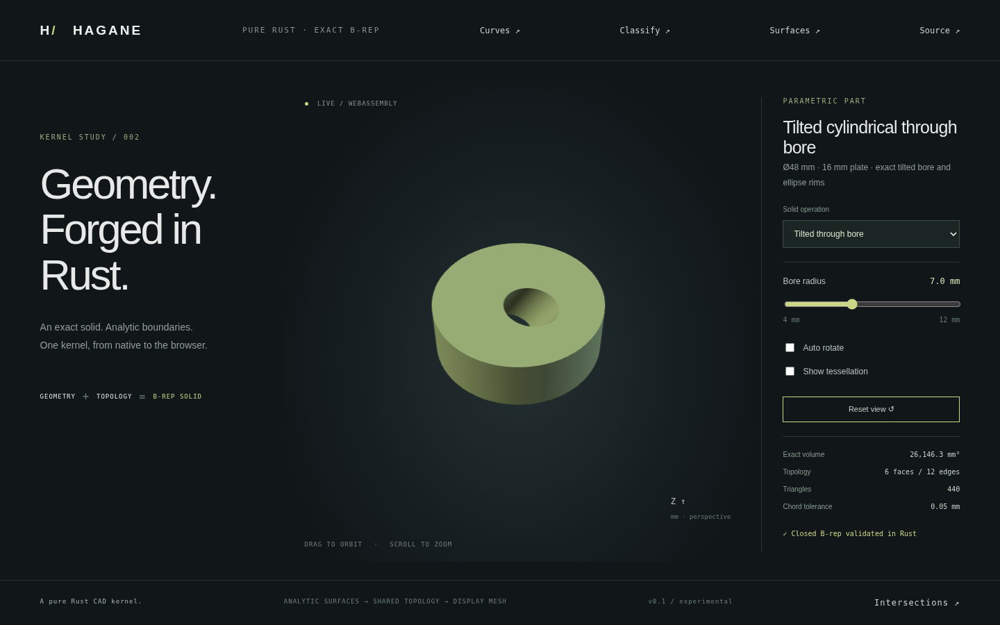
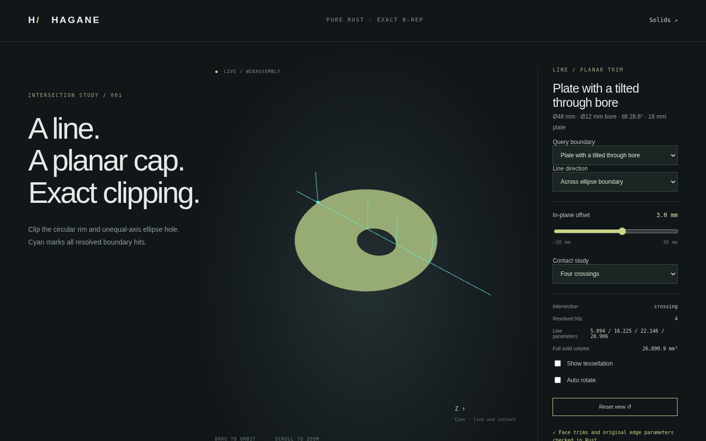

# Unequal-axis ellipse holes and tilted through bores



Planar complete-ellipse faces now accept up to sixteen complete-ellipse holes
with different axis ratios and relative phases. Each complete wire consists of
two opposite pi-sweep ellipse arcs. Geometry, oriented shared edges and plane
pcurves remain exact; tessellation is only for display.

## Certified domain

Map the outer ellipse to the unit disk. For each hole, the largest singular
value of its transformed two-axis matrix bounds an enclosing circle. Accept
only circles strictly inside the unit disk and separated from every
other hole circle or certified by an analytic supporting line, with physical tolerance, curve coherence and floating-point
margins. The finite supporting-line search can reject valid nonoverlapping ellipses
when it finds no direction with a resolved gap. Rejection means unsupported or unresolved,
not proof that the actual ellipses intersect. Ill-conditioned axes, touching,
near-coincident boundaries and more than sixteen holes are rejected. Holes in
arc/chord loops and arbitrary mixed boundary loops remain unsupported.

The validated regions support exact area/first moments and solid volume,
point classification, analytic line intersections with original parameters,
material intervals and B-rep-derived bounded tessellation.

## Closed solid example

`tilted_bore_demo_solid(R, r, H, tilt, tolerance)` constructs a restricted
circular plate centered at the origin with a centered circular cylindrical
through bore tilted about Y. It is an analytic construction, not a general
Boolean operation. The plate is horizontal and has radius R and height H.
Dimensions must exceed ten linear tolerances, tilt is in [-pi/3, pi/3], and
`R - H/2 * abs(tan(tilt)) - r/cos(tilt)` must exceed the required clearance.
Final topology validation also applies the conservative ellipse certificate.

Horizontal cap hole centers are `(z*tan(tilt), 0, z)` at `z = ±H/2`;
ellipse semiaxes are `r/cos(tilt)` and `r`. The inner walls are true framed
circular cylinder surfaces. Their cap pcurves are harmonic height graphs,
sharing exact ellipse rim edges with the planar faces. The result has six
faces, twelve shared edges and eight vertices, with inward bore wall normals.
Its independent analytic volume is:

```text
V = pi * (R² - r²/cos(tilt)) * H
```

Run the native cap query example or generate the whole display mesh:

```sh
cargo run --example tilted_bore -- 0.5 3 0
cargo run --example part -- 25
./scripts/build-web.sh
python3 -m http.server 8000 --directory web
```

In the main browser demo select **Tilted through bore**. The bore radius slider
covers 4–12 mm for a 48 mm diameter, 16 mm high plate and tilt 0.5 radians.
Preset 25 accepts control values 8–24 and converts them to half-size bore radii.
Orbit, zoom and wireframe operate on the actual solid mesh. On the intersections
page select **Plate with a tilted through bore** to inspect the elliptic cap.



## Verification and provenance

Native tests check analytic volume, dimensions, shared-edge closure/orientation,
rigid rotation, micron-scale geometry, inside/outside and physical boundary
bands, cap line roots, and independent circular/elliptic chord errors. Invalid
dimensions, nonfinite inputs, containment/contact and unresolved line queries
return errors. WASM checks independently recompute roots and volume and compare
native geometry. Browser tests exercise the full solid, its radius controls,
and cap crossing/tangent/empty queries. Screenshots above capture that renderer.

The certificate uses elementary affine geometry, the spectral norm derived
from the largest eigenvalue of a 2×2 Gram matrix, the triangle inequality and
a lower bound on the outer matrix's least singular value. Oblique cylinder
sections follow direct substitution of a plane into the circular cylinder
parameterization. These are independently implemented public mathematical
facts; no OCCT source or new dependency was used. See [supporting-line separation and parallel bores](ellipse-separation.md),
[references](references.md)
and [licenses](../LICENSE-MIT).
