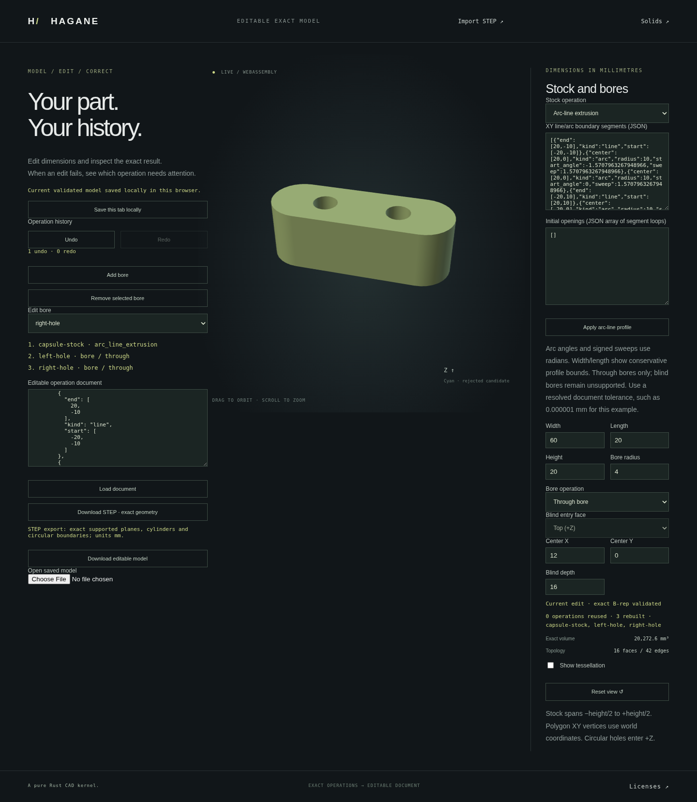

# Editable line/arc stock and through bores



`arc_line_extrusion` adds a custom analytic profile to the existing native/WASM
operation document. Lines and signed circular arcs form an outer ring and
optional disjoint initial openings. Rust builds and certifies an actual normal
prism B-rep, then applies subsequent normal through bores to that solid.
Triangulation follows exact construction and validation.

This extends the [rounded-stock editor](workflow-rounded.md) to authored mixed
profiles, including noncentered world-XY coordinates and pre-existing holes.
The existing incremental cache, Undo/Redo, JSON restoration, local autosave and
bounded analytic STEP download retain the profile and bore editing intent.

## Reproduce

```sh
cargo run --example workflow -- docs/workflow-arc-line-example.json
```

Build the WASM kernel as described in the README, serve `web/`, and open
`workflow.html`. Load the [example](workflow-arc-line-example.json), or choose
line/arc extrusion and edit its outer/inner segment arrays. Angles are radians;
lengths and heights are millimetres. Stock spans −height/2 to +height/2.
Bore centers use world XY. Width/length are display summaries of the profile;
the segment data and height determine the actual geometry.

The example is a capsule with two radius-10 ends separated by 40 mm, height
20 mm, and two radius-4 through bores at (−12, 0) and (12, 0). Its outer wire
contains two lines and four circular quarter arcs. Analytic source volume is
`20 * (800 + 100π)`; retained volume is `16000 + 1360π` mm³. The retained
body has 28 vertices, 42 shared edges, 16 faces and genus two.

The additive schema-version-1 stock operation is:

```json
{
  "kind": "arc_line_extrusion",
  "id": "capsule-stock",
  "outer": [
    {
      "kind": "line",
      "start": [
        -20,
        -10
      ],
      "end": [
        20,
        -10
      ]
    },
    {
      "kind": "arc",
      "center": [
        20,
        0
      ],
      "radius": 10,
      "start_angle": -1.5707963267948966,
      "sweep": 1.5707963267948966
    },
    {
      "kind": "arc",
      "center": [
        20,
        0
      ],
      "radius": 10,
      "start_angle": 0,
      "sweep": 1.5707963267948966
    },
    {
      "kind": "line",
      "start": [
        20,
        10
      ],
      "end": [
        -20,
        10
      ]
    },
    {
      "kind": "arc",
      "center": [
        -20,
        0
      ],
      "radius": 10,
      "start_angle": 1.5707963267948966,
      "sweep": 1.5707963267948966
    },
    {
      "kind": "arc",
      "center": [
        -20,
        0
      ],
      "radius": 10,
      "start_angle": 3.141592653589793,
      "sweep": 1.5707963267948966
    }
  ],
  "height": 20
}
```

The operation above supplies the complete capsule outer boundary. Optional
`holes` defaults to an empty array. Segments have these forms:

```json
{"kind":"line","start":[-20,-10],"end":[20,-10]}
{"kind":"arc","center":[20,0],"radius":10,"start_angle":0,"sweep":1.5707963267948966}
```

Positive and negative sweeps retain the intended curve direction. Rings must
close and form simple, separated boundaries; either winding is accepted and
normalized by the existing exact profile constructor. Unknown fields and
malformed/nonfinite numbers reject. Older schema-1 readers reject this new
operation kind explicitly.

## Supported domain

At least one arc must occur across the profile rings. Line-only profiles use
the existing polygon `extrusion` operation. Each arc has positive resolved
radius and nonzero signed sweep with absolute value at most π/2. Longer arcs
can be authored as multiple pieces; a full circular wire uses four quarters.
There may be at most 128 combined profile segments and 16 combined openings,
including initial inner rings and four additional arc segments for each new
through bore. These are shared geometry budgets, not separate per-node limits.

Height is positive and resolved. Source construction and normal-prism
certification use the absolute representation tolerance; profile admission and
height additionally use the stored relative policy at the actual solid extent.
Subsequent bores use that same full policy. World-coordinate arithmetic and
whole-curve reconstruction budgets can explicitly reject otherwise plausible
inputs. The example uses linear tolerance 1e-6 mm.

Initial holes must lie strictly inside the outer ring, with no crossing,
contact or nesting. Through bores must lie in actual material and remain
separated from prior openings. A bounding rectangle does not certify curved
containment. Blind bores, skew extrusion, arbitrary-plane stock and general
curved Booleans remain unsupported in this document operation.

Changing the profile or stock height invalidates its cached suffix; editing a
later bore reuses earlier accepted exact solids. Invalid profile, contact,
blind, resource or display edits preserve the accepted cache and history.
Accepted mesh positions are centered only for viewing; raw reports, saved
world coordinates and STEP geometry retain their original placement. Rejected
candidate outlines use that accepted display offset.

STEP exports use the existing bounded analytic writer; inspect them in
`step-bounded.html`. STEP preserves geometry/topology and JSON preserves
editable intent. Display chord bounds apply to supporting surfaces; circular
trim chords may include a void sliver within the requested chord bound.
General symmetric trim-boundary approximation is not claimed.

## Verification

The frozen source passes all 867 native tests, formatting checks, strict
all-target clippy and the wasm32 release build. Independent tests verify
noncentered actual replay, initial rectangular/circular openings, signed ring
reversal, analytic area/volume, opposing shared edges and dense pcurves, source
bounds, bounded STEP round trips and genuine `Arc<Solid>` prefix reuse.
Valid 128-segment source stock and subsequent over-budget edits verify shared
resource limits; invalid profile, contact, blind and tolerance inputs leave
accepted snapshots intact.

The complete WASM suite passes on that same build, including all legacy
regressions and the new capsule/translated-profile history. It checks actual
cylinder placement/radii, supporting-surface chord bounds, mesh closure/genus,
STEP/native parity, analytic volumes, prefix counts and failure recovery.

The complete browser suite also passes on the same WASM build, including all
legacy regressions. The new checks cover noncentered profiles with initial
openings and additional through bores, native parity, actual STEP download and
reimport, profile/cache invalidation, contact and blind-input rollback,
Undo/Redo, JSON upload/autosave restoration, orbit and mobile layout. The
screenshot above was captured from the checked example in the actual browser.

These checks use `CARGO_PROFILE_DEV_DEBUG=0`, `CARGO_PROFILE_TEST_DEBUG=0` and
`CARGO_INCREMENTAL=0` for native child builds in the 32 GiB cloud workspace.
They omit debug symbols and incremental caches while preserving ordinary
assertions and default optimization levels. Generated development artifacts
were cleaned with `cargo clean --profile dev` after exhausting workspace space;
source and validation logs were preserved. The resulting complete build uses
approximately 1.1 GiB of target artifacts.
