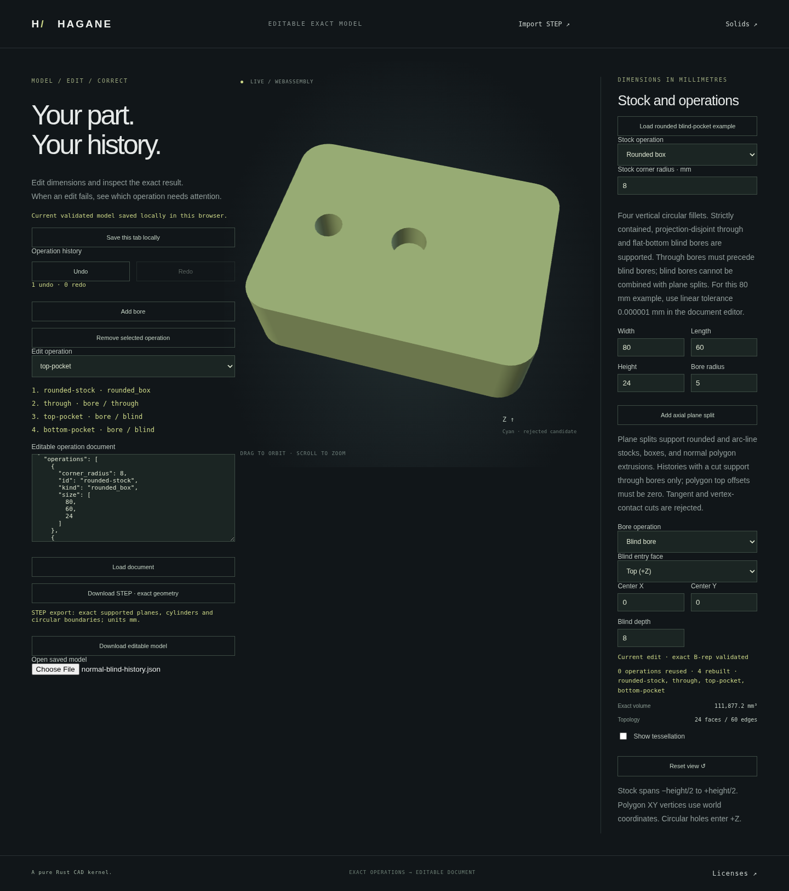

# Editable blind pockets on normal curved stock



Schema-version-one `rounded_box` and `arc_line_extrusion` histories now accept
resolved flat-bottom `bore` operations with `mode: "blind"`. This connects exact
continued machining to the existing incremental workflow, browser editing,
Undo/Redo, operation-document persistence and bounded analytic STEP export.
No new document schema or alternate mesh modeling path is introduced.

Supported order is stock, optional disjoint through bores, then one or more
projection-disjoint blind bores. Top entry is the default; `entry: "bottom"`
selects the opposite cap. Each blind bore requires an explicit finite `depth`
and retains a resolved floor. World XY centers use the stock's actual placement;
centers are not silently recentered. The original stock and previous cavities
remain exact B-reps with shared oriented edges and same-parameter pcurves.

Each blind node calls `append_blind_bores_normal_prism` on the actual preceding
solid using the workflow's complete absolute/relative tolerance policy. Original
geometry is retained, the combined old/new source is certified, and the actual
kept B-rep becomes the node result. Editing a later depth reuses the unchanged
prefix and rebuilds its suffix. Invalid edits preserve accepted geometry and
cache state; the browser preserves the last accepted display and STEP body.
Accepted documents and mutable edit drafts are copied separately, so a rejected
operation cannot alter the accepted document while leaving an old mesh visible.

Example: [rounded stock with through/top/bottom cuts](workflow-normal-blind-example.json).
Its 80 × 60 × 24 mm stock with radius-8 corners, radius-4 through bore,
radius-5/depth-8 top pocket and radius-3/depth-6 bottom pocket has exact volume
`109056 + 898π` mm³ (approximately 111877.150203 mm³).
Run the existing native workflow and session examples:

```sh
cargo run --example workflow -- docs/workflow-normal-blind-example.json
cargo run --example workflow_session -- docs/workflow-normal-blind-example.json
```

Build `./scripts/build-web.sh`, serve `web`, and open `/workflow.html`. Choose
**Load rounded blind-pocket example**, select a bore, edit its center/radius/depth/entry,
and rebuild. Save/load the intent document, Undo/Redo edits, or download the
actual accepted STEP body. The screenshot is recorded from the running page.

Limits: 16 total initial openings plus added bores and 128 reserved profile
segments. All projected disks must be strictly separated, including opposite
entry pockets with a retained axial web. Through bores after a blind node are
explicitly unsupported. Histories containing any plane split still reject blind
nodes; blind machining after plane cuts and later plane cuts remain planned for
this workflow. Contacts, unresolved dimensions and general curved intersections
return diagnostics identifying the failing operation.

Legacy box/polygon blind histories retain their existing behavior, including
supported opposite-entry axial-web cases; this narrower projection rule applies
to the newly supported curved-stock histories. Unrelated through-bore and
plane-cut workflows retain their prior domains.

Verification: formatting, strict all-target Clippy, 939 native/doc tests and
release WASM build passed. All preceding WASM regressions and the focused new
blind-history checks passed on the same binary. Floor checks distinguish
separate circular boundaries even when opposite-entry floors share a height.
Browser checks cover all workflow-page regressions and new blind histories,
including accepted-document/draft isolation, native/STEP parity, Undo/Redo,
rejected edits, autosave and mobile/orbit behavior.
