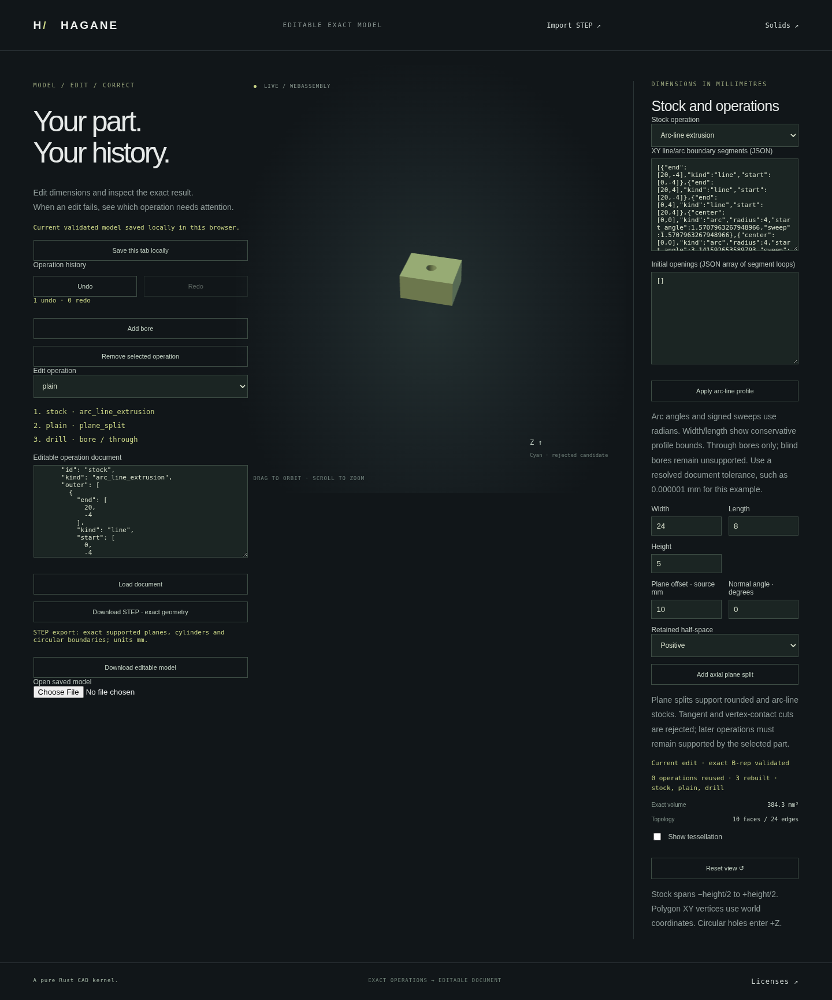

# Normal-prism machining after straight-sided cuts



An editable rounded/line-arc stock no longer becomes terminal when a cut
removes its last curved boundary. Subsequent normal through bores and plane
cuts operate on the actual retained B-rep, including straight-sided children
and children whose only arcs belong to earlier holes. Display meshes are
constructed afterward; no mesh Boolean or replacement stock is used.

## Reproduce the actual part

```sh
cargo run --locked --example workflow -- docs/workflow-plain-continuation-example.json
```

Start the Web demo using the README instructions, open `web/workflow.html`,
and load [this saved document](workflow-plain-continuation-example.json) in
the JSON editor. Its stock is a D-shaped line/quarter-arc profile extruded
5 mm in Z. Keeping x > 10 removes the semicircular end and leaves an actual
10 by 8 by 5 mm rectangular solid with volume 400 mm³. A radius-1 mm
through bore at (15, 0) produces volume `400 - 5*pi` mm³ and genus one.
The stock and cut retain their world coordinates; Z runs from -2.5 to 2.5 mm.

Further cuts remain available. Keeping x < 18 on that bored body yields
`320 - 5*pi` mm³. Keeping x > 18 instead discards the first hole and leaves
80 mm³; adding a radius-0.5 bore at (19, 0) yields `80 - 1.25*pi` mm³.
These are actual operation sequences, with closed topology, pcurves and
analytic STEP round trips checked independently.

## Additive Rust APIs

```rust
use hagane::{bore_normal_prism, GeometryTolerance, Point3, Vec3};
# fn example(source: &hagane::Solid) -> hagane::Result<()> {
let tolerance = GeometryTolerance::new(1e-6, 1e-10, 0.0)?;
let result = bore_normal_prism(
    source, Point3::new(15.0, 0.0, 0.0), 1.0,
    Vec3::new(0.0, 0.0, 1.0), tolerance,
)?;
let retained = result.kept();
assert!(retained.volume()? > 0.0);
# Ok(())
# }
```

`split_normal_prism_by_plane_components(source, plane, extrusion_axis,
tolerance)` likewise returns every closed component on both sides, with
actual paired section faces. Existing `bore_normal_arc_line_prism` and
`split_normal_arc_line_prism_by_plane_components` retain their Arc-source
domains. The new APIs return the existing result types.

The axis is required and unoriented: opposite signs and finite nonzero
magnitudes select the same physical cap family. A box admits three families,
so face ordering cannot choose a machining direction. The source must have
exactly two unsubdivided cap planes in that family. All-line admission uses
the full actual planar-prism correspondence certificate, followed by the
shared normal translation, wall, cap and whole-curve proofs. Skew translation
is rejected by physical transverse displacement, not only an angular test.

## Supported domain and remaining limits

The existing normal-prism precision, line/arc trim containment, contact and
resource guards remain in force. All-line sources use the planar certificate's
128-face limit; normal mixed profiles allow up to 128 profile segments and
16 openings. Bores must be disjoint and strictly contained. Tangency, vertex
contact, ambiguous/subdivided cap families, unresolved numerical precision,
full-circle single-edge rim representations and general curved Booleans
remain unsupported. Component partitions have their existing 64-component,
128-section and 1024-total-segment bounds.

Editable workflow roots remain `rounded_box` or `arc_line_extrusion` for
plane cuts; this milestone does not add cut nodes to Box/Polygon root histories.
The workflow passes its known Z axis to the generic APIs. Selected sides must
contain one body. Blind bores remain unsupported in these histories.

Accepted exact prefixes are reused, while suffixes rebuild from their actual
retained solid. Invalid later machining identifies its operation and preserves
the accepted cache, document, mesh, STEP export and Undo/Redo history.
Display supports the existing supporting-surface chord error and circular
trim-chord allowances; no general symmetric trim-boundary bound is claimed.

## Verification

Native owner and independent review cases check explicit X/Y/Z axis heights,
large/tiny and opposite axis hints, reordered caps, rigid placement, micro
dimensions, concave disconnected partitions and retained polygon openings.
They check analytic volumes, closed oriented topology, original line coverage,
pcurves, display chords and actual bounded analytic STEP round trips.
Malformed/skew sources, invalid axes and excessive precision demands reject
without changing the source. Existing Arc-only APIs still reject all-line
sources. Workflow tests check append/truncate, actual prefix pointer reuse,
replayed B-rep equality, crossed/notched later holes, operation-specific failure
and atomic recovery.

The frozen implementation passes `cargo fmt --all -- --check`, strict
`cargo clippy --locked --all-targets -- -D warnings`, 906 native tests and
2 documentation tests, and the release `wasm32-unknown-unknown` build.
Validation uses debug symbols and incremental compilation disabled to keep
the managed environment's disk use bounded; assertions remain enabled.
The saved three-node example reports volume 384.2920367320511 mm³,
24 edges and 10 faces.

The full WASM runtime suite also passes against that frozen release binary,
including all legacy checks, the updated genuine all-line workflow success
case, and the new independent rectangular/disk continuation sequences. The
focused browser checks pass actual volume, native parity, STEP reading, prefix
reuse, failure preservation, Undo/removal relinking and autosave.

The complete browser suite passes on the same binary, including every legacy
demo and the new continuation checks. Full WASM and browser suites ran
serially and passed on their first invocation. The screenshot above is the
actual saved three-node part loaded into the browser after those checks,
using the viewer's supported zoom controls.
