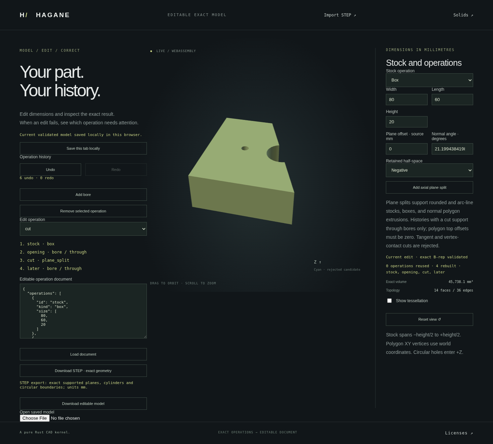

# Editable plane cuts in box and polygon stock



`plane_split` nodes now work with `box` and normal-Z `extrusion` roots,
in addition to rounded and line/arc roots. Through bores can precede and
follow the cuts. Every node consumes the actual retained closed B-rep;
original stock bounds cannot authorize a tool in discarded material.
Display meshes are generated from the resulting topology, with no mesh CSG.

## Reproduce the part

```sh
cargo run --locked --example workflow -- docs/workflow-planar-cuts-example.json
```

Start the Web demo as documented in the README, open `web/workflow.html`,
and load [this document](workflow-planar-cuts-example.json). An 80 by 60 by
20 mm box first receives a radius-8 through bore. A plane through the origin
with XY normal angle 0.37 radians retains its negative side, crossing that
hole and creating an actual circular notch in the outer boundary. A radius-2
through bore at (-20, 0) then creates a new closed opening. By central
symmetry, the resulting volume is `48000 - 720*pi` mm³.

The browser exposes the existing cut offset, angle and side controls,
operation removal/relinking, saved JSON, Undo/Redo, local restore and STEP
download. Stored angles use radians; browser controls use degrees.
Polygon profiles may be noncentered, concave and contain polygon openings.
Resolved opening crossings and multiple material intervals are supported.
The selected side must contain exactly one connected solid; selecting
multiple bodies rejects atomically.

## Normal-stock domain

Polygon extrusion XY offset must be exactly zero (omitted is zero). Skew
stock in a cut history returns `plane_split_normal_stock_required` with the
first cut's operation ID. No tolerance-based projection changes the stock.
Every bore in a cut history must be through, with top/default entry and no
depth. Blind machining rejects with `normal_split_blind_bore_unsupported`
and the offending bore's ID, whether the bore precedes or follows a cut.
Existing rounded/arc-specific blind diagnostic codes are preserved.

Initial polygon cap segments plus two source faces must not exceed 128.
Initial openings plus authored bores must not exceed 16. Early reservation
is `initial_segments + 4*bores + 3*cuts <= 128`, with four initial segments
for a box. Counts are not refunded when later cuts discard material. This
reservation is not a bound on segments added by every opening crossing;
actual child constructors and certificates independently check their limits.

Every operation uses the existing explicit-axis normal-prism APIs with Z
as the known physical axis. Their source/wall/curve coverage, precision,
contact and containment guards apply. Tangency, vertex passage, meaningful
skew, unresolved precision, full-circle single-edge source rims, general
curved Booleans and disconnected selected bodies remain unsupported.

## Cache and exact representation

Box/polygon histories without plane cuts preserve their existing full-circle
bore representation and through/blind operations. Histories containing cuts
construct bores as four actual quarter arcs for normal-prism certification.
Adding the first cut or removing the last cut changes this construction
domain. Only the unchanged stock prefix is reused across that transition;
prior bores rebuild even when their saved parameters are identical.
Within the same domain, ordinary unchanged exact prefixes are reused.
Native tests check the actual shared stock pointer, replacement bore pointer,
operation counts and exact equality to a fresh rebuild.

Cut-history STEP export uses the bounded analytic writer, retaining actual
shared subarcs, walls and pcurves. No-cut histories keep their legacy writer.
Invalid geometry, schema or display edits leave accepted document, B-rep
cache, mesh, STEP export and Undo/Redo history unchanged.

Display uses existing supporting-surface chord bounds and circular trim
chord allowances; no general symmetric trim-boundary approximation is claimed.

## Verification

New native owner/review tests check bores before/after cuts, independent
box/L-profile volumes, concave disconnected-side selection, retained and
crossed rectangular openings, reordered/oblique sections, micro and scaled
stock, dense pcurves, opposing coedges and actual STEP round trips.
They check first/last-cut mode transitions against fresh B-reps, real stock
pointer reuse, prior bore replacement, within-domain prefix reuse, named
blind/skew/contact failures and atomic recovery. Sixteen openings and the
125-corner admitted/126-corner rejected cut reservation are covered.
Legacy Box/Polygon rejection fixtures now assert their actual supported
volumes/topology; skew remains a rejected atomic-edit case.

The frozen implementation passes `cargo fmt --all -- --check`, strict
all-target Clippy, 913 native tests, two documentation tests and the release
WASM build. Debug symbols and incremental compilation are disabled for
managed-environment disk use; assertions remain enabled. The actual saved
four-node example reports 45738.053289415344 mm³, 14 faces and 36 edges.

Focused native/WASM history and browser checks pass new Box/concave Polygon
operations, native parity, actual bounded STEP reading, mode-aware cache
reuse, rejected blind/skew intent, removal relinking and Undo.

The full WASM runtime suite passes on the frozen release binary. The complete
affected workflow-page browser regression also passes with all original
assertions: legacy Box/Polygon/skew through/blind histories, rounded/line-arc
roots, opening crossings, plane/plain/new planar continuations, prefix reuse,
operation rewiring, Undo/Redo, saved JSON, corrupt/quota/conflicting-tab
autosave handling, native/STEP parity and decimal-coordinate preservation.
Unrelated browser pages were not rerun for this workflow-only milestone;
the immediately preceding normal-prism milestone ran the all-page suite.
The screenshot above is the actual saved four-node part after browser checks.
