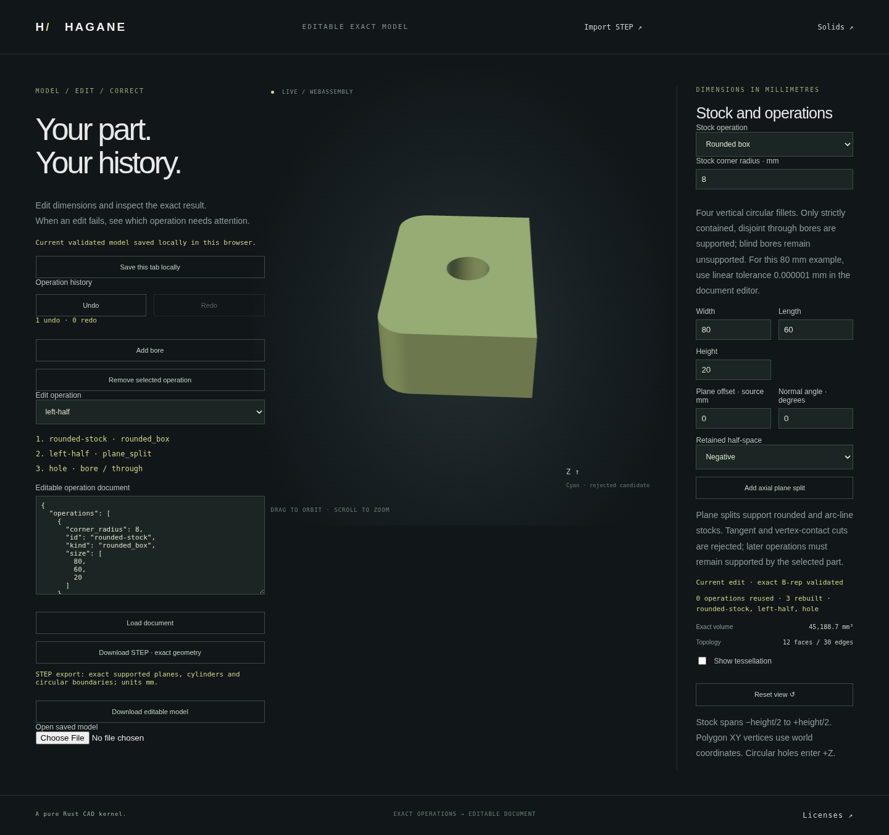

# Editable analytic-stock plane cuts



The existing workflow now accepts `plane_split` operations after rounded-box
or line/arc extrusion stock. Each node keeps the selected actual closed B-rep
and passes it to later cuts or normal through bores. JSON retains editable
cut intent; STEP retains the accepted geometry and topology.

```sh
cargo run --locked --example workflow -- docs/workflow-plane-split-example.json
./scripts/build-web.sh
python3 -m http.server 8000 --directory web
```

Open `workflow.html`, load the [example](workflow-plane-split-example.json),
and select `left-half` under **Edit operation**. Its cut fields are editable;
select `hole` to edit the subsequent bore. Add or remove either operation type.
Removal rewires the remaining linear input chain. Undo/Redo and local restore
replay documents through the same checked Rust session.

The example creates an 80 × 60 × 20 mm box with radius-8 corners, keeps X≤0,
then drills a radius-6 through hole at (−18, 0). Final volume is
`45440 - 80*pi = 45188.6725877` mm³. Its actual closed genus-one B-rep has
20 vertices, 30 shared edges and 12 faces. Stock spans Z=−10 to Z=+10.
The screenshot records that exact document rather than a separately modeled
visual example.

## Operation and coordinates

```json
{
  "kind": "plane_split",
  "id": "left-half",
  "input": "rounded-stock",
  "offset": 0,
  "normal_angle": 0,
  "side": "negative"
}
```

`normal_angle` is in radians, and `offset` is signed distance in millimetres.
The world-space plane equation is
`cos(normal_angle)*x + sin(normal_angle)*y = offset`.
The plane is parallel to world Z, which is these workflow roots' extrusion
axis. Negative/positive refer to the sign of the equation's left side minus
`offset`. Offset is not a fraction of stock width or a displacement from its
center: noncentered profiles use the same absolute world-coordinate equation.
The browser angle control displays degrees and saves radians.

The operation is additive to schema version 1. Unknown fields, invalid side
values, nonfinite input, bad references and unsupported stock histories reject.
Older readers reject the new operation kind. IDs identify operations; persistent
face IDs and arbitrary operation graphs are not provided.

## Actual replay and limitations

Plane cuts invoke [the analytic prism partition](arc-line-prism-split.md) on
the actual preceding solid and retain the requested side. Later bores also
use that retained solid, so the original stock bounding box cannot admit a
hole in material already removed by a cut. Cuts before and after bores are
supported when every actual cut satisfies its geometric domain. An initial
opening wholly on one side follows that side; discarded openings are removed
with discarded material.

`rounded_box` and `arc_line_extrusion` roots admit these nodes.
[Box and normal polygon roots](workflow-planar-cuts.md) now also admit cuts,
with through-only machining and an explicit cache-domain transition. Each cut
uses the [component partition](arc-line-prism-split-components.md), including
resolved opening crossings and multiple material intervals. The selected side
must contain exactly one connected component; the other side may contain more.
Tangent/vertex contact and meaningful skew remain unsupported. Blind bores
remain unsupported on these curved-stock
histories. All-line children now support subsequent normal through bores and
plane cuts through the [normal-prism continuation](workflow-plain-continuation.md)
APIs.
A line outer boundary with retained curved openings still has curved geometry.

Resource admission counts bores and cuts by type. There may be at most 16
combined initial openings and authored bores. The early history reservation
is `initial_segments + 4*bores + 3*plane_splits <= 128`; rounded-box stock starts
with eight segments. This reservation does not decrement when a cut removes
an opening. It is not an upper bound on extra segments from crossed openings;
actual child constructors/certificates independently enforce their 128-segment
limit. Seventeen valid cut nodes are tested without consuming a bore count.

Changing offset, angle or side rebuilds that node and its dependent suffix;
unchanged accepted exact B-rep prefixes are reused. Root/profile/tolerance
changes invalidate the corresponding prefixes. A failed geometry, schema or
display edit preserves the accepted document, solids, export and Undo/Redo
history. Changing a cut can invalidate a later hole; the failure identifies
that operation instead of changing its center or silently dropping it.

Display-only centering preserves stored world coordinates, raw reports and
STEP placement. Rejected candidate outlines use the accepted display offset.
Supporting-surface chord bounds and circular trim-chord allowances are inherited
from the existing display implementation; general symmetric trim-boundary
approximation is not claimed.

## Verification

New owner and independent native tests verify direct equality to actual API
composition, rounded and noncentered line/arc roots, analytic volumes,
subsequent bores on both sides, retained/discarded opening ownership, dense
pcurves, shared opposing edges, closed display and actual STEP round trips.
Real prefix pointer reuse, side/offset edits, append/truncate/removal and fresh
replay equality are checked. A genuine display failure after successful
geometry rebuilding preserves the accepted cache and STEP export. Bad roots,
unresolved contact, blind input and unknown fields reject atomically. All-line
continuation now has positive volume/topology/cache regression coverage. Signed-zero cache equivalence
and legacy box/polygon bore histories are covered.

The focused browser run passes actual volume/topology, cache/intent retention,
cut/bore removal and relinking, invalid-side/contact preservation, Undo/Redo,
JSON/autosave, native/STEP parity, orbit and mobile layout. The first focused
WASM oracle assumed a half-capsule had an extra vertical outer segment; the
actual capsule has five outer segments and two tangent stock junctions. Only
those independent expected counts were corrected. The corrected focused run
passes all volumes, world-coordinate cuts, pcurves/closure/native parity and
failure recovery; the initial failed log was preserved.

The final frozen implementation passes all 885 native tests and two
documentation tests, formatting checks, strict all-target clippy and the
wasm32 release build. Cloud validation uses `CARGO_PROFILE_DEV_DEBUG=0`,
`CARGO_PROFILE_TEST_DEBUG=0` and `CARGO_INCREMENTAL=0`; assertions and default
optimization levels are preserved.

The full WASM validation passes on the same frozen release binary, including
all legacy suites and the new plane-cut workflow cases. The final focused
browser check also verifies that selecting a cut hides unrelated bore fields
and selecting a bore restores its actual saved parameters.

The final full browser suite passes with all existing assertions unchanged,
including the new editable plane-cut workflow, STEP round trips and display
preservation checks. The screenshot was refreshed from that validated release
binary. Full WASM and browser suites ran serially.
