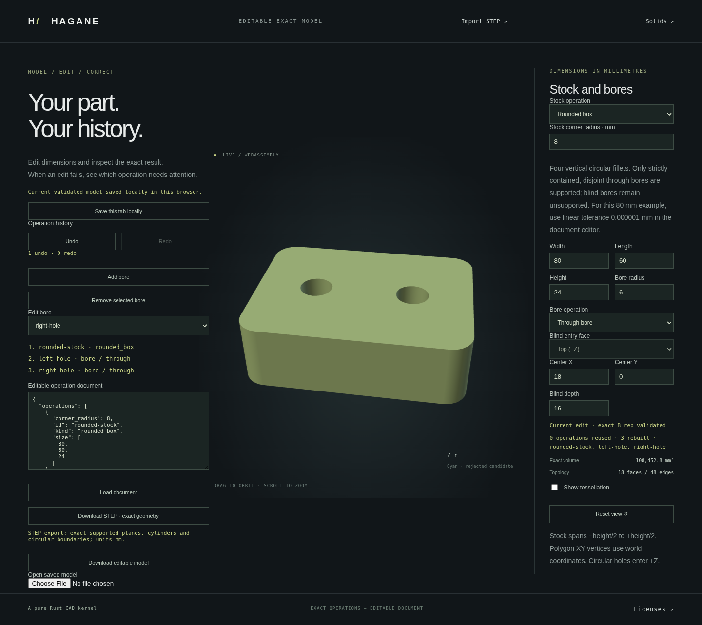

# Editable rounded stock and through bores



A later milestone adds [editable blind pockets](workflow-normal-blind.md) to
these stock histories. Through bores may precede projection-disjoint blind
nodes with top/bottom entry; through-after-blind and blind plane-cut histories
remain unsupported. The through-only examples below remain valid. Earlier
blanket blind restrictions and their historical regression descriptions are
superseded for this supported domain.

The existing native/WASM operation document now accepts a `rounded_box` root.
It constructs a centered box and fillets all four original Z-parallel edges,
retaining exact line/circular-arc cap boundaries and cylindrical corner walls.
Subsequent `bore` nodes with `mode: "through"` use the
[normal line/arc prism bore](arc-line-prism-bore.md) operation on each actual
accepted B-rep. Display triangulation follows construction and validation.

This connects the rounded-stock and circular-hole operations to the existing
incremental editing session rather than storing a mesh or flattening the
history. The source and hole parameters remain in the document.

## Reproduce

Run the native example:

```sh
cargo run --example workflow -- docs/workflow-rounded-example.json
```

Build the shared WASM kernel using `scripts/build-web.sh`, serve `web/` as
described in the README, and open `workflow.html`. Load the
[example document](workflow-rounded-example.json) into the document editor.
Select a bore to edit it; change stock dimensions or its corner radius, add or
remove holes, and use Undo/Redo. Download the editable JSON to preserve intent
or download actual analytic AP214 STEP geometry.

The example has an 80 × 60 × 24 mm rounded box, corner radius 8 mm,
and two radius-6 mm holes centered at (−18, 0) and (18, 0).
Stock spans −height/2 to +height/2; XY bore centers are world coordinates.
Its analytic volume is
`height * (width * depth - (4 - π) * corner_radius² - π * Σ bore_radius²)`.

The root operation has this shape:

```json
{"kind":"rounded_box","id":"rounded-stock","size":[80,60,24],"corner_radius":8}
```

The existing schema version remains 1. This is an additive operation-kind
extension: older readers explicitly reject the unknown kind. Millimetres and
all three explicit tolerance fields remain mandatory; unknown fields reject.
Existing box and polygon histories retain their behavior.

## Acceptance and rejection

There may be at most 16 sequential disjoint through bores. Each input references
the immediately preceding operation and every operation ID is unique. Corner
radius must be positive and resolved, leaving straight portions on both XY
sides. Circular tools must lie strictly in actual rounded material; the
bounding box alone does not certify a bore near a curved corner.

Blind cuts are supported in the separate domain described above. Through cuts
after blind nodes and blind plane-cut histories remain unsupported. Oblique cuts,
intersecting/nested/contacting holes, unresolved wall gaps and dimension or
coordinate precision failures reject. Choosing rounded stock does not silently
change an existing blind hole into a through hole or rewrite its tolerances.
The example uses linear tolerance 1e-6 mm. A stricter setting can honestly
exceed the reserved floating-point reconstruction budget at this stock scale.

`WorkflowSession` reuses unchanged accepted exact-solid prefixes. Editing a
later bore rebuilds only that suffix; changing the stock or tolerance
invalidates the relevant prefix. Geometry, parsing and display failures leave
the accepted cache intact. Browser rejection also retains accepted geometry,
and Undo/Redo history. Downloads remain disabled until the edit is valid again. Existing autosave and JSON restoration validate
this new operation through the same Rust session.

Rounded histories use the bounded analytic STEP writer, preserving actual
shared circular arcs, cylinder faces and both surface-parameter uses of each
edge. Box and polygon histories keep the existing STEP writer. STEP exports
geometry/topology, not operation history; JSON is the editable format.
Use `step-bounded.html` to inspect exported rounded-stock STEP geometry; the
older `step.html` reader does not admit these bounded circular arcs.

This remains a centered normal-prism workflow, not a general feature graph,
arbitrary-edge fillet editor or general curved Boolean system. Display chord
bounds apply to supporting surfaces; circular trim chords can include a sliver
of void no wider than the requested chord bound. No exact CAD operation is
replaced by that display approximation.

## Verification

The frozen implementation passes all 861 native tests, formatting checks,
strict all-target clippy and the wasm32 release build. New independent tests
check actual direct-operation replay equality, analytic volume, genus, opposing
coedges, dense same-parameter pcurves, exact `Arc<Solid>` prefix identity and real
rebuild counts. Sixteen-hole stock is closed and round-trips through bounded
STEP; a seventeenth hole and invalid stock/geometry/document/tolerance edits
reject without replacing accepted snapshots.

The complete WASM suite also passes on that same build, including the new
rounded-stock history after every existing regression block. Checks cover
independent stock/holed volumes, actual bounded STEP geometry and native
report parity, cylinder chord bounds, opposed welded closure, genus, inward
hole walls and cap opening allowances. Suffix edits, stock invalidation,
remove/re-add and overlap/corner-void/blind/precision rejection preserve the
accepted cache and match fresh native/session results.

The complete Chromium browser rerun passes on the same WASM build, including
rounded-stock editing, two through holes, native parity, actual bounded STEP
reimport, incremental counts, corner-void/contact/blind rejection, Undo/Redo,
JSON file restoration and local autosave reload. The screenshot records the
actual accepted example above.

An initial complete run failed an existing circular-graph canvas byte comparison
before the new rounded-workflow block. Its isolated replay passed all five
unchanged pixel comparisons; the complete rerun also passed those comparisons
and every remaining block. The initial failure log is retained. Failure-only
image/layout/model diagnostics were added; the exact byte-equality assertion
was preserved. Viewer and Rust source remained frozen during the replay.
